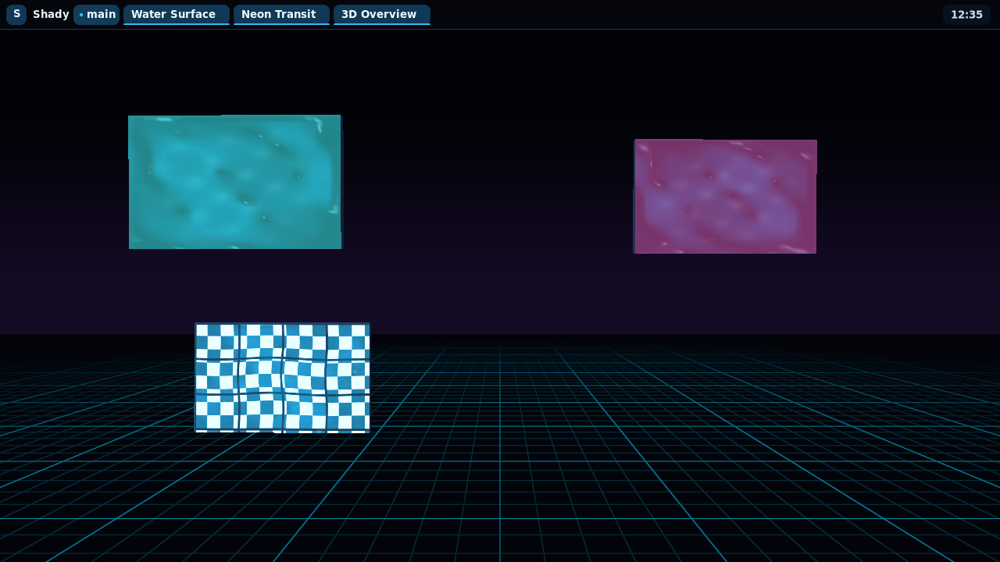

# shady



*Neon Transit rice: standalone shell, native 3D overview, compositor title bars and borders, translucent windows, and shader-backed liquid surfaces.*

Shady is an experimental **3D Wayland compositor** built on wlroots 0.20.2 and inspired by TinyWL. It can run as a conventional compositor through its wlroots scene-graph path, or turn normal xdg-shell applications into objects inside a shared perspective 3D world.

Windows can move through depth, fold into cubes, collide with authored environments, be picked up and thrown, or receive native-plugin-driven surface effects. Shady also includes a standalone layer-shell desktop shell, Lua configuration/runtime scripting, and a public C plugin API for extending spatial behavior without putting every experiment into the compositor core.

The project is intentionally experimental. The imported TinyWL example is CC0; see [its license](LICENSES/tinywl-CC0.txt).

## API documentation

- [API overview](docs/API.md)
- [Lua API](docs/LUA_API.md)
- [Headless / automation API](docs/HEADLESS_API.md)
- [C plugin API](docs/C_PLUGIN_API.md)
- [Shader API](docs/SHADER_API.md)

## Highlights

- Custom GLES2 renderer for Wayland surfaces in a perspective 3D world
- Native C plugin API with module state, window state, events, input hooks and render controls
- Native **3D overview** (`Super+O`) with keyboard selection, focus confirmation and layout restore
- Native **water-window** effect (`Super+W`) with mesh waves, UV refraction, Fresnel light, specular glints, caustics and size-adaptive reflections
- Configurable global window opacity with premultiplied-alpha blending in both spatial and safe scene-graph paths
- Standalone `shady-shell` with taskbar, workspaces, launcher, window context menu and Quick Settings
- First-person WASD + mouse-look navigation, jumping and player collision
- FPS window bodies are plugin-defined: cube, squash, springy jelly and deformable folded-paper mesh examples can be swapped while render, picking and physics share one representation contract
- Window gravity, bounce, friction, wobble and collision response
- OBJ environment loading with authored `collision_*` geometry and SAT collision
- Built-in floor, cyan grid, projected shadows, lit 3D window shells and sky/environment support
- Orbit camera with 3D ray-picking
- Animated crumple-style window closing
- **Lua 5.4 scripting** for bootstrap configuration, key bindings, runtime events and automation
- Headless UI automation plus ASan/UBSan daily-driver and spatial regression suites
- Window recovery tools and automatic respawn when a cube falls out of the world

## Controls

### First-person mode

| Input | Action |
|---|---|
| F2 | Enter / leave first-person mode |
| F3 | Toggle navigation capture / normal client interaction |
| F4 | Toggle window gravity |
| F5 | Toggle collision / picking debug rendering |
| W / A / S / D | Move |
| Mouse | Look |
| Space | Jump |
| Left click | Grab / release the cube at the center of view |
| Right click while holding | Throw the held cube |
| Scroll while holding | Change held distance |

The development Lua config also binds:

| Input | Action |
|---|---|
| F6 | Toggle gravity through Lua |
| F7 | Expand all windows / fold all windows |
| F8 | Print all live windows to the log |
| F9 | Respawn all windows |
| Ctrl + Alt + Q | Quit through Lua |

The F7–F9 bindings are implemented in `test-shady.lua`, not hard-coded compositor controls. They are examples of what can be built with the scripting API.

### Orbit mode

| Input | Action |
|---|---|
| Right-button drag | Orbit camera |
| Alt + middle-button drag | Pan camera |
| Alt + scroll | Zoom |
| Alt + Shift + scroll | Move focused window along Z |
| Alt + Tab | Cycle windows |
| Alt + F11 | Animate and request window close |
| Alt + arrows | Pan |
| Alt + Q / E | Orbit yaw |
| Alt + `=` / `-` | Zoom |
| Alt + `0` | Reset camera |

The focused window is highlighted visually: desktop/safe mode draws a thin cyan focus ring, while the spatial renderer applies a subtle cyan/brightness lift to the focused window.

## Building on NixOS

Shady currently targets **wlroots 0.20.2**. The Nix development shell provides wlroots, GLES/EGL, Lua 5.4, Meson and Ninja.

```sh
nix develop
./build.sh
```

`build.sh` reconfigures Meson and builds with Ninja:

```sh
meson setup --reconfigure build
ninja -C build
```

For a new build directory, run `meson setup build` first.

Run Shady nested inside an existing Wayland session:

```sh
WLR_BACKENDS=wayland ./build/shady
```

Run Shady directly on a Linux VT/TTY with DRM + libinput:

```sh
./run-native.sh
```

For the first DRM/TTY smoke test, use the compatibility renderer path first:

```sh
./run-native.sh --safe -s foot
```

Once DRM modesetting, keyboard/mouse input, VT ownership and shutdown all work, try the full spatial compositor and then Night Observatory.

`--native` forces wlroots to use `drm,libinput`, clears nested Wayland/X11 display variables, and requires a normal login-provided `XDG_RUNTIME_DIR`. The wlroots build used by the Nix shell links `libdrm`, `libudev`, and `libseat`, so it can acquire the GPU/input seat through logind or seatd. Run it from a real Linux VT login, not from a terminal emulator inside another compositor. If libseat cannot acquire the active seat, try from a real VT login (for example Ctrl+Alt+F3) or, on a seatd setup, run through `seatd-launch`.

```sh
seatd-launch ./build/shady --native
```

For a plain desktop/safe path that bypasses the spatial renderer, physics,
FPS interaction and visual effects, use:

```sh
WLR_BACKENDS=wayland ./build/shady --safe
```

For a genuinely small build, omit the spatial stack, runtime Lua scripting module, and standalone shell. The tiny bootstrap Lua config engine remains available so `config.lua` still works:

```sh
meson setup build-minimal -Dspatial=disabled -Dlua=disabled -Dshell=disabled
ninja -C build-minimal
```

The minimal build uses the wlroots scene renderer directly and does not require
the GLES2 renderer, so it can run with `WLR_RENDERER=pixman` as well.

### Standalone shell

The default build also produces `build/shady-shell`, a separate Wayland client rather than compositor-internal UI. Its first version is a 32px top `wlr-layer-shell` bar rendered with wl_shm + Cairo/Pango. It reserves a 32px exclusive zone so maximized windows use the remaining work area, while fullscreen windows still occupy the entire output.

```sh
./build/shady-shell
```

For native testing, Shady can start the shell and a terminal together:

```sh
./run-native.sh -s './build/shady-shell & exec foot'
```

The compositor also exposes `text-input-v3` and `input-method-v2` and bridges focused text clients to a single seat input method, including preedit/commit/delete state and input-method keyboard grabs for IME use. `xdg-activation-v1` requests are handled for mapped toplevels so launched applications can request focus through activation tokens. Fractional scaling is advertised through `wp_fractional_scale_v1` together with `wp_viewporter`; wlroots scene surfaces provide the preferred scale feedback based on output visibility. `wp_cursor_shape_v1` is also handled so clients can request standard server-side cursor shapes without uploading cursor surfaces.

The bar consumes Shady's `shady-shell-v1` Wayland protocol. On bind it receives the known workspace list, active workspace, focused window metadata, and (with protocol v2) the mapped window list. Later workspace/window/focus changes are pushed incrementally. Workspace labels are clickable and send `activate_workspace(name)` back to the compositor. Mapped windows on the current workspace appear as task chips: left-click activates a window and right-click opens a window context menu. The menu supports Focus, Maximize/Restore, Fullscreen/Exit Fullscreen, moving the window to any known workspace, and Close. The focused task receives the cyan accent. Clicking the clock opens Quick Settings with Launcher, Next window, workspace switching, and Quit Shady actions. The clock remains minute-resolution so an otherwise idle desktop is not woken every second.

The shell also owns an application launcher. `shady.toggle_launcher()` emits a shell-protocol event that toggles a centered overlay surface with exclusive keyboard focus. It indexes standard `.desktop` application entries and supports incremental text search, Up/Down selection, Enter to launch, Backspace, and Escape. Because the launcher is out-of-process, app discovery/rendering policy stays outside the compositor core.

The protocol source lives in `protocols/shady-shell-v1.xml`. Version 1 remains the small workspace/focused-window surface; version 2 adds stable shell window IDs, mapped-window snapshots/updates, and activate/close requests used by the taskbar. Version 3 adds window state updates plus maximize, fullscreen, and move-to-workspace actions used by the task context menu. Version 4 adds shell session actions for cycling windows and terminating the compositor, used by Quick Settings. Launcher state, notifications, network/audio backends, and other shell policy remain outside the compositor core.

Safe mode renders the wlroots scene graph directly and uses normal scene-graph
pointer hit testing. It is the compatibility baseline for work toward a daily-driver compositor.

The spatial renderer is demand-driven as well: client surface commits, input,
configuration changes and module actions wake a frame, while continuous frames
are only requested while time-dependent state is active (for example physics,
FPS movement/falling, wobble/tilt settling, or close animations). An otherwise
idle spatial desktop does not redraw solely to advance shader time.

Or launch a client automatically:

```sh
WLR_BACKENDS=wayland ./build/shady -s foot
```

For the repository development setup:

```sh
./test.sh
```

### Daily-driver sanitizer smoke test

A separate compatibility profile exercises the non-spatial compositor under
AddressSanitizer and UndefinedBehaviorSanitizer. It starts two headless outputs,
keeps an xdg-toplevel alive while disabling the output that contains it, checks
that the window is recovered onto the remaining output, then repeatedly
creates and destroys client windows.

```sh
nix develop
./daily-driver.sh all
```

`./daily-driver.sh build` only builds the sanitizer profile and
`./daily-driver.sh test` reruns the smoke test plus an idle-render regression.
The idle check leaves a headless compositor untouched for one second and fails
if it develops a continuous frame loop. Set `SHADY_RENDER_STATS=1` when running
Shady manually to log per-output render scheduling requests, coalesced requests,
delivered frame callbacks, 3D CPU frame timing (effects, windows, overlays,
submit/commit), and the reason any continuous frames were requested. The profile intentionally uses
the 2D/pixman path so failures in basic desktop lifecycle handling are isolated
from the spatial renderer and physics stack.

### Spatial sanitizer regression suite

The 3D stack has a separate GLES2/headless sanitizer suite. It covers matrix and ray math (including wobble and full window-shell hits), physics collision/sweeps, entering and leaving FPS mode with live windows, the native `focus-depth` plugin, the native `spatial-overview` enter/restore path, animated `water-windows` frame/toggle behavior, and Neon Transit shutdown:

```sh
./tests/spatial-suite.sh
```

This suite uses an AddressSanitizer/UndefinedBehaviorSanitizer spatial build and software GLES2 so renderer/module regressions can be exercised without a physical display.

For a more opinionated ricing demo, the repository includes **Night Observatory**:

```sh
nix develop
./examples/rice/night-observatory/run.sh
```

For a direct TTY/DRM Night Observatory session:

```sh
nix develop
./examples/rice/night-observatory/run-native.sh
```

It combines a Lua bootstrap config, runtime Lua events/keybindings, the spatial stack, and the hot-reloadable `orbit-layout` native plugin to arrange windows as a loose 3D constellation. The demo starts a terminal automatically when launched without extra arguments; `Super+Return` opens another terminal and `Super+D` opens an available launcher. See `examples/rice/night-observatory/README.md` for controls and details.

A second rice, **Neon Transit**, demonstrates a different native-plugin approach: `focus-depth` leaves screen-space x/y placement alone but animates focused/background windows along Z using the C plugin API and module tick callback.

Shady requires the **GLES2** renderer for its custom shaders. The compositor prints the allocated `WAYLAND_DISPLAY` so more clients can be launched from another terminal.

## Lua configuration and scripting

Shady embeds **Lua 5.4** and uses it in two phases. `config.lua` is the bootstrap configuration language and runs **before module dependency resolution**; `init.lua` is the optional runtime scripting layer and runs after modules are initialized.

The bootstrap config defaults to:

```text
$XDG_CONFIG_HOME/shady/config.lua
```

or `~/.config/shady/config.lua`. Pass `-c /path/to/config.lua` to select another file. A complete example lives at `examples/config.lua`.

### Bootstrap configuration

```lua
shady.set("spatial_mode", true)
shady.set("window_gravity", true)
shady.set("window_wobble", true)
shady.set("shadows", true)
shady.set("background_top", "#080B14")
shady.set("background_horizon", "#101827")
shady.set("background_bottom", "#05070C")
shady.set("floor_grid_strength", 0.12)
shady.set("floor_fade_end", 3.5)
shady.set("window_tint", "#FFFFFF")
shady.set("window_effect_strength", 0.15)
shady.set("window_brightness", 1.10)
shady.set("window_opacity", 0.92) -- 0.0 transparent, 1.0 opaque
shady.set("window_border_width", 3.0) -- 0 disables borders
shady.set("window_border_color", "#12394A")
shady.set("window_border_focus_color", "#28E6FF")
shady.set("window_titlebar", true) -- false disables compositor title bars
shady.set("window_titlebar_height", 28.0)
shady.set("window_titlebar_color", "#0B1F29")
shady.set("window_titlebar_focus_color", "#123B4D")
shady.set("window_titlebar_text_color", "#EAF9FF")

shady.bind("fps_toggle", "F2")
shady.bind("fps_capture", "F3")

shady.modules({
    ["window-motion"] = true,
    ["physics"] = true,
    ["fps"] = true,
    ["close-animation"] = true,
    ["scene-effects"] = true,
    ["lua"] = true,
})
```

`shady.config(key, value)` is an alias for `shady.set(key, value)`. `shady.module(name, enabled)` changes one module, while `shady.modules(table)` changes several. These are runtime selections within whatever modules were compiled into the binary.

Native plugins are also loaded from the bootstrap phase:

```lua
shady.plugin("/absolute/path/to/my-plugin.so")
```

Because plugin loading happens before capability resolution, external plugins participate in the same dependency graph as built-in modules.

Close animations are plugin-selectable as well. The public API exposes `window_set_close_effect()`, `window_close_effect()`, and `window_reset_close_effect()`. A plugin selects a built-in render style plus timing/strength/direction per window; `window_close()` then runs that effect instead of bypassing the compositor animation. The default remains `SHADY_CLOSE_EFFECT_CRUMPLE`, while `examples/plugins/close_slide_fade.c` demonstrates `SHADY_CLOSE_EFFECT_SLIDE_FADE`:

```c
struct shady_close_effect effect = {
    .style = SHADY_CLOSE_EFFECT_SLIDE_FADE,
    .duration = 0.52f,
    .strength = 1.0f,
    .direction_x = 0.95f,
    .direction_y = 0.22f,
};
api->window_set_close_effect(host, window, &effect);
```

Load the example with `shady.plugin("/path/to/libshady-plugin-close-slide-fade.so")` to replace the close style for mapped windows; unloading/resetting the plugin returns them to the default crumple effect.

### Runtime Lua

When the `lua` runtime module is enabled, Shady then looks for `$XDG_CONFIG_HOME/shady/init.lua` (or `~/.config/shady/init.lua`). `SHADY_LUA_INIT` can select another runtime script. Runtime Lua is intended for callbacks, live window inspection, bindings, and orchestration rather than rendering or physics hot loops.

### Runtime key bindings

Lua callbacks can be attached to XKB key combinations:

```lua
shady.bind("F6", function()
    shady.toggle_gravity()
    shady.log("gravity toggled")
end)

shady.bind("Ctrl+Alt+q", function()
    shady.quit()
end)
```

Supported modifier names are `Alt`, `Shift`, `Ctrl`/`Control`, and `Super`/`Logo`. Compositor bindings are matched against the keymap's unmodified base keysym plus a separate modifier mask, so combinations such as `Super+Shift+1` and `Super+Shift+Q` do not depend on the shifted printable symbol (`!`, `Q`, etc.).

### Event API

C plugins and Lua scripts consume the same event bus and object payloads. Lua subscribes with `shady.on(name, callback)`, which returns a subscription token. Pass that token to `shady.off(token)` to detach the handler:

```lua
shady.on("window.mapped", function(window)
    shady.log("opened: " .. window.app_id .. " / " .. window.title)
end)

shady.on("window.focused", function(window)
    shady.log("focused: " .. window.app_id)
end)

local token = shady.on("output.added", function(output)
    shady.log("output: " .. output.name)
end)

-- Later:
shady.off(token)
```

Current event names are `window.created`, `window.mapped`, `window.unmapped`, `window.focused`, `window.resized`, `window.state_changed`, `window.destroyed`, `output.added`, `output.removed`, `workspace.changed`, `module.started`, and `module.stopped`. Window lifecycle ordering is `created -> mapped -> focused` and shutdown normally follows `unmapped -> destroyed`.

Window callbacks receive `Window` userdata rather than plain tables. Properties include `title`, `app_id`, `mapped`, `x`, `y`, `width`, `height`, `visible`, `workspace`, `maximized`, `fullscreen`, and spatial `z`. Methods include `window:focus()`, `window:close()`, `window:maximize([enabled])`, `window:set_fullscreen([enabled])`, and `window:move_to_workspace(name)`. Handles validate liveness before dereferencing so stale Lua references degrade to `nil`/`false` instead of touching freed compositor state.

### Runtime API

Current scripting calls include:

```lua
shady.log("hello")
shady.spawn("foot")
shady.rule({ app_id = "firefox", workspace = "web", maximized = true })
shady.toggle_gravity()
shady.toggle_fps()
shady.quit()

local windows = shady.windows()
local focused = shady.focused_window()
local current = shady.current_workspace()
local workspaces = shady.workspaces()
shady.workspace("code")
shady.expand_all()
shady.fold_all()
shady.respawn_all()

shady.camera("yaw", 1.0)
shady.camera("pitch", -0.2)
shady.camera("distance", 2.5)
shady.camera("target_x", 0.0)
shady.camera("target_y", 0.0)
shady.camera("target_z", -1.0)
```

`shady.spawn(command)` launches a command asynchronously through `sh -lc` and returns whether the child process was created successfully. Shady reaps exited children through the Wayland event loop.

### Headless automation API

Runtime Lua also exposes `shady.automation` for deterministic headless UI tests. It can synthesize compositor shortcuts and pointer input, schedule non-blocking follow-up steps, and capture the current output through the screencopy protocol:

```lua
shady.automation.key("Ctrl+F12")
shady.automation.key_down("F10")
shady.automation.key_up("F10")
shady.automation.move_pointer(320, 240)
shady.automation.click("left")
shady.automation.drag(100, 100, 400, 260, "left", 8)
shady.automation.scroll(1, 0)
shady.automation.type_text("hello from headless")

shady.automation.after(100, function()
    shady.automation.screenshot("/tmp/shady.png", function(ok, path)
        assert(ok)
        shady.log("captured " .. path)
    end)
end)
```

`automation.key(spec)` sends a press/release pair through Shady's normal module/keybinding path. `key_down(spec)` and `key_up(spec)` expose the same compositor/module input path separately, which is useful for testing stateful module controls. `type_text(text)` uses the virtual-keyboard protocol through `wtype` to type into the focused Wayland client. `move_pointer(x, y)` uses output-layout coordinates. `click(button)` accepts `left`, `middle`, `right`, or a Linux button code. `drag(x1, y1, x2, y2[, button[, steps]])` holds a pointer button while moving between two layout coordinates. `scroll(vertical[, horizontal])` injects wheel-axis events. `after(ms, fn)` schedules a one-shot callback on the Wayland event loop, so automation never blocks compositor progress. `screenshot(path[, callback])` captures through `grim` and Shady's screencopy protocol, returns the capture process PID, and invokes `callback(ok, path)` only after the capture process has finished. The development shell includes both `grim` and `wtype`; Shady also advertises xdg-output metadata and a keyboard capability in headless mode so capture and virtual-keyboard automation work without physical devices.

`shady.rule({...})` installs an ordered window rule. A rule matches exact `app_id` and/or `title` fields and can set `workspace`, `maximized`, and `fullscreen`. The first matching rule wins and is applied during the map lifecycle before focus. Workspaces also retain a per-workspace last-focused window and restore it when switching back.

`shady.windows()` returns live mapped `Window` objects, including windows on inactive workspaces; inspect `window.visible` to distinguish the current workspace. `shady.focused_window()` returns the keyboard-focused window or `nil`. `shady.workspace(name)` lazily creates/switches named workspaces, while `shady.current_workspace()` and `shady.workspaces()` expose the current workspace and known names. The same object model also exposes `shady.outputs()` (`Output` objects with `name`, `width`, `height`, `scale`), `shady.seat()` (`Seat.name`), and `shady.modules()` (`Module.name`, `Module.active`). This mirrors the opaque Window/Output/Seat/Module handles in the C plugin API.

## 3D environments

Shady can load OBJ geometry as both visual environment geometry and authored collision geometry.

Collision groups/objects use a `collision_` prefix:

```obj
g collision_room
v -0.75 -0.62 -1.60
v  0.75 -0.62 -1.60
v  0.75 -0.62 -0.40
f 1 2 3
```

Faces in collision groups are converted into triangle colliders. Window cubes first use broad-phase bounds and then exact triangle-vs-AABB SAT tests, allowing sloped and non-box environment geometry instead of treating every OBJ group as a solid rectangular volume.

The repository includes `assets/test-room.obj` as a development example.

## Window recovery

Thrown windows can leave the useful part of the world. Shady therefore has two recovery mechanisms:

- Window physics automatically respawns a cube after it falls sufficiently far below the world or travels beyond the configured internal Z safety limit.
- Lua exposes `shady.respawn_all()` for manual recovery. The development config binds this to **F9**.

`shady.windows()` can be used to inspect which clients are still alive even when their physical cubes are no longer visible.

## Legacy configuration

The original INI-style configuration loader is still available for compatibility:

```ini
physics_enabled = true
window_gravity = false
window_wobble = true
shadows = true
floor = true
fps_mode = true

bind.fps_toggle = F2
bind.gravity_toggle = F4
```

Use `shady --legacy-config /path/to/config` to load one. `-c` now selects the bootstrap `config.lua`; Lua is the primary configuration path.

## Project layout

```text
src/
  assets/             OBJ and mesh loading
  modules/
    lua/              embedded Lua runtime and Shady scripting API
    physics/          cube gravity and world collision
    fps/              first-person movement, grabbing and throwing
    window_motion/    wobble and inertial rotation
    close_animation/  close state machine
    scene_effects/    floor and shadow effects
    environment/      visual environment loading
  render/             GLES2 pipeline, math, picking and debug rendering
  shell/              standalone layer-shell desktop UI client
  world/              shared world and collider representation
assets/               development OBJ environments
shaders/              editable GLSL
```

The important architectural boundary is that the world owns collision geometry. Physics and interaction query that shared representation rather than embedding knowledge of individual environment objects.

Lua sits above that core as an orchestration layer:

```text
Wayland / wlroots
       |
       v
   Shady C core
   /    |     \
render physics world
       |
       v
  Lua scripting
```

## Module host and build-time modules

Shady now has a built-in module host. Modules own their runtime state and optional per-window state, and can declare capabilities they provide, capabilities they require, and optional capabilities that only affect load ordering when present. The resolver performs a stable dependency sort, rejects missing required capabilities, duplicate active providers, and dependency cycles, then initializes modules in dependency order and destroys them in reverse order.

State ownership follows the same boundary. The `spatial` foundation owns only shared camera/world/timing state plus each window's Z coordinate. Physics owns gravity and per-window velocity, FPS owns capture/grab/expanded state, window-motion owns wobble/tilt state, and close-animation owns its per-window state machine. Render and picking code consume those features through public module APIs/read-only accessors rather than embedding their state inside spatial window objects.

Current built-in modules are `desktop-protocols`, `workspace`, `spatial`, `window-motion`, `physics`, `fps`, `close-animation`, `scene-effects`, and `lua`. `workspace` provides `desktop.workspace` and owns named workspace membership/visibility per window. `spatial` provides the shared 3D renderer/window-state capability; the other spatial features are independent submodules that require or optionally consume those capabilities. Lua follows whichever optional capabilities are present and scripts can feature-detect them with `shady.has_capability(...)`.

For example, all of these are valid build shapes:

```text
minimal desktop
spatial only
spatial + window-motion
spatial + physics
full spatial stack + Lua
```

Meson exposes the top-level modules and spatial subfeatures:

```text
-Dspatial=enabled|disabled|auto
-Dlua=enabled|disabled|auto
-Dphysics=enabled|disabled|auto
-Dfps=enabled|disabled|auto
-Dwindow_motion=enabled|disabled|auto
-Dclose_animation=enabled|disabled|auto
-Dscene_effects=enabled|disabled|auto
```

Built-ins and external native plugins share the same module descriptor model. External plugins use explicitly versioned experimental ABIs. **V1** is the simple/stateless entry contract; **V2** adds explicit state migration while continuing to use the V1 host API table. ABI compatibility is scoped to each declared ABI version.

### Native C plugins

Public headers are installed as `shady/module.h` and `shady/plugin.h`. A plugin exports one entry symbol and returns a module descriptor:

```c
#include <shady/plugin.h>

static const struct shady_plugin_api_v1 *api;

static void start(struct shady_server *server) {
    (void)server;
    api->log(SHADY_PLUGIN_LOG_INFO, "my plugin started");
}

static const char *const provides[] = { "example.my-plugin", NULL };
static const struct shady_module module = {
    .name = "my-plugin",
    .provides = provides,
    .start = start,
};

const struct shady_module *shady_plugin_entry_v1(
        uint32_t abi, const struct shady_plugin_api_v1 *host, void *ctx) {
    (void)ctx;
    if (abi != SHADY_PLUGIN_ABI_V1 || host->struct_size < sizeof(*host))
        return NULL;
    api = host;
    return &module;
}
```

The host API is object-oriented around opaque `shady_host`, `shady_window`, `shady_output`, `shady_seat`, and `shady_module_handle` values. It exposes object enumeration and queries, focused/visible/maximized/fullscreen window state and actions, named workspace enumeration/switching/window movement, module/window state access for module-owned data, logging, capability checks, config mutation, render scheduling, compositor termination, and event subscriptions for the same event stream used by Lua. Native plugins can also set/query a per-window animated water surface (`window_set_water_effect()` / `window_water_effect()`) and its fragment-surface style (`window_set_water_surface()` / `window_water_surface()`). Per-window borders can be overridden with `window_set_border()`, inspected with `window_border()`, and returned to global config with `window_reset_border()`. The renderer combines mesh waves and UV refraction with deformed-normal Fresnel, specular highlights, cyan tinting, and moving caustics, while handling shader time and demand-driven continuous frames only while the effect is active. Native `.key` hooks can use the stable `SHADY_KEY_*` and `SHADY_MODIFIER_*` constants from `shady/module.h`, so plugins do not need wlroots unstable input headers. `subscribe_event_handle()` returns a `shady_subscription_id` that can be removed with `unsubscribe_event()`. The older boolean `subscribe_event()` remains available as a convenience wrapper.

Plugins never need the private layout of Shady's server/window/output structs. Plugins are loaded from bootstrap Lua with `shady.plugin(path)` and then participate in normal capability resolution, initialization, hooks, events, and reverse-order teardown. `examples/plugins/hello.c` exercises the V1 host/seat/output/module/event APIs. `examples/plugins/counter.c` is a V2 stateful plugin showing module and per-window migration. `examples/plugins/focus_depth.c` demonstrates tick-driven Z animation, `examples/plugins/spatial_overview.c` demonstrates a fully native `Super+O` 3D overview that saves per-window positions, spreads visible windows into a depth grid, lets arrow keys move the selected window, uses Enter to focus/exit, and Escape to cancel/restore, and `examples/plugins/water_windows.c` demonstrates shader-backed liquid window surfaces toggled with `Super+W`, including geometry waves, multi-scale slope-aware refraction, Fresnel edge light, dual-lobe moving specular highlights, cyan water tint, animated caustics, crest/trough shading, and thin-water transmission. `examples/plugins/border_accent.c` demonstrates the border API by toggling a focused window between the configured border and a 7px magenta override with `Super+B`.

### Hot reload and state migration

Runtime Lua can hot-unload or reload external plugins by module name:

```lua
shady.unload_plugin("hello-plugin")
shady.reload_plugin("hello-plugin")
```

Plain hot-**unload** remains intentionally limited to stateless plugins because removing a stateful module leaves nowhere to preserve live state. Hot-**reload** supports stateful plugins through `SHADY_PLUGIN_ABI_V2`.

A V2 descriptor keeps `struct shady_module` unchanged and adds a schema version plus snapshot/restore callbacks for module state and per-window state. Snapshot memory is allocated by Shady, not the plugin, so it remains valid after the old `.so` is unmapped. The new plugin receives the previous schema version and can migrate older snapshots into a new state layout.

The reload flow is:

```text
stage a fresh copy of the new .so
        -> dlopen and validate name/capabilities/ABI
        -> snapshot old module + live-window state
        -> stop/destroy old instance
        -> allocate/init new state
        -> restore snapshots
        -> dlclose old .so
        -> start new instance
```

The staged copy is created beside the original plugin so a broken replacement can be rejected before the working old plugin is torn down. If new init/restore fails after teardown begins, Shady attempts to re-init the still-mapped old plugin and restore the same snapshot before reporting reload failure.

A reload must preserve all capabilities previously provided by the plugin. Stateful migration also refuses to silently drop existing module or per-window state. `examples/plugins/counter.c` demonstrates V2 module and window snapshot callbacks; its development test preserves both a start counter and a live window marker across reload.

Event subscriptions are owned by the shared object that supplied the callback and are automatically removed before `dlclose()`. When unload/reload is requested from inside an event callback, Shady defers the operation to the Wayland event-loop idle phase so the current event payload and remaining subscribers stay valid until dispatch completes.

## Current status

Shady is a research/experimental compositor, not a production desktop.

The current focus is building a coherent **physical 3D desktop** with a scriptable user-facing layer. Working experiments include folded window cubes, grabbing and throwing, window physics, authored OBJ collision meshes, triangle SAT collision, FPS navigation, sky rendering, shadows, Lua key bindings/events, live-window inspection and out-of-world recovery.

Areas still under active development include richer Lua window objects, per-window scripting actions, more accurate player collision against triangle geometry, richer environment/world semantics, better shadow receivers, multi-output behavior and general rendering/interaction polish.
