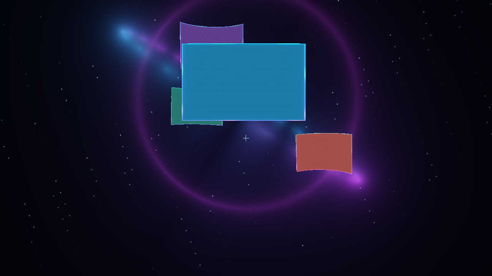

# Astral Loom



*Actual headless GLES capture with four test clients; application textures remain live.*

A live 3D window observatory: cyan and violet energy rings, floating curved
application panels, traveling luminous edges, and an animated orbital or helical
workspace. All effects live in `astral-loom`, an external C plugin; the compositor
core is unchanged.

## Run

From the repository root:

```sh
nix develop
./build.sh
./examples/rice/astral-loom/run.sh
```

For a local Linux VT/TTY session:

```sh
./examples/rice/astral-loom/run-native.sh
```

The launcher starts the shell and three terminals. Open more apps to see the
orbital arrangement. Set `SHADY_STARTUP` to choose your own startup command.

The rice enters FPS mode immediately so the indexed curved meshes are visible.
Use **Super+Shift+F** to release mouse capture for app interaction. Use **Super+F**
to return to the orbit camera and ordinary flat windows. This uses the existing
FPS interaction model: WASD/mouse movement while captured, left click to pick up
or release a panel, and right click to throw a held panel. Restore the ordinary
layout before dragging windows yourself; the animated layout controls position.

## Controls

| Shortcut | Action |
| --- | --- |
| Super+J | Toggle animated layout; restore original X/Y/Z positions |
| Super+Shift+J | Switch orbit / helix |
| Super+B | Freeze or resume scene motion |
| Super+F | Switch FPS curved panels / orbit camera |
| Super+Shift+F | Release or capture mouse in FPS mode |
| Super+Tab | Focus the next app; it moves to the front |
| Super+Return | Open a terminal |
| Super+D | Toggle launcher |
| Super+Shift+R | Reload the plugin |
| Super+Q | Close the focused app |
| Super+Shift+Escape | Quit |

The focused panel relaxes toward a flat surface for readability. Background
panels bend across a 16 × 16 grid, with shared geometry for rendering and picking.
Maximized/fullscreen and hidden windows are excluded from the layout. Returning
to it captures their current placement again. Reload restores positions and
releases plugin shaders and providers before rebuilding the effect.

Super+B freezes the background, orbit phase, and panel ripples. Layout and focus
transitions still settle, and the subtle window-edge shader continues animating.
The procedural background uses 48 ray steps per pixel; performance depends on
GPU and resolution. It is a screen-space energy observatory, while app panels
use the compositor's real 3D geometry and depth buffer.

## Verification

```sh
nix develop -c ninja -C build headless-automation-probe
nix develop -c bash tests/headless-astral-loom.sh
```

The headless GLES scenario opens four clients and checks depth separation,
layout restoration, plugin reload, window closure, and screenshot capture.
Set `SHADY_ASTRAL_SCREENSHOT=/tmp/astral.png` to keep its captured frame. For a
sanitized build, set `SHADY_SPATIAL_TEST_BUILD_DIR` to that build directory.

Do not load other plugins that own window positions, representation providers,
or custom window shaders alongside this effect. The standalone shader files are
resolved relative to `SHADY_ROOT`, which both launchers set automatically.
