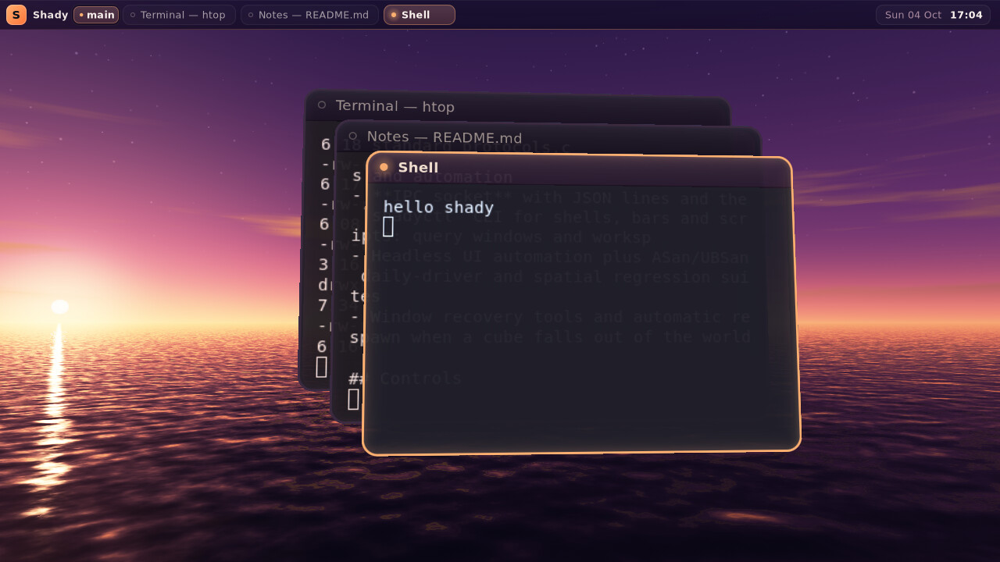
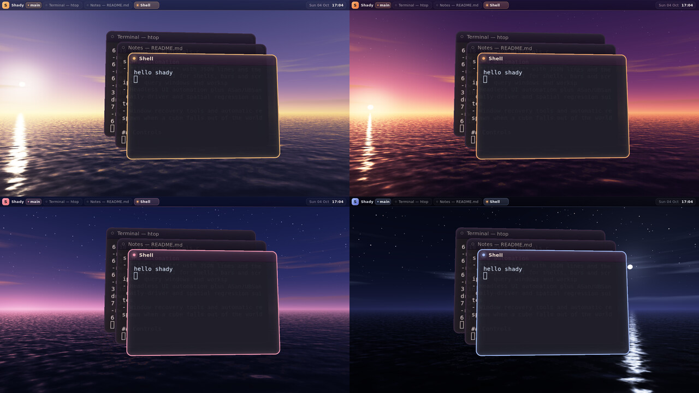

# Afterglow



A low sun over a mirror-still sea. Windows float like warm glass panes above the
water. The sky, the sea, the window accents and the shell all share one light, and
that light moves through four hours with `Super+T`.



*Golden hour · afterglow (default) · blue hour · night.*

## Run

```sh
nix develop
./tools/build.sh
./rices/afterglow/run.sh          # nested in a Wayland session
./rices/afterglow/run-native.sh   # directly on a VT (DRM + libinput)
```

Without arguments the launchers start `shady-shell` and a terminal (`$TERMINAL`,
default `foot`). Pass `-s '<command>'` to start something else.

## Controls

| Binding | Action |
|---|---|
| `Super+T` / `Super+Shift+T` | Next / previous hour (2.4 s cross-fade) |
| `Super+Return` | Terminal |
| `Super+D` | Launcher |
| `Super+O` | 3D overview |
| `Super+Tab` | Cycle windows |
| `Super+Q` | Close (the window sinks into the sea) |
| `Super+1..3` | Workspaces `shore`, `studio`, `harbor` |
| `Super+Shift+1..3` | Move focused window to a workspace |
| `Super+M` / `Super+Shift+M` | Maximize / fullscreen |
| `Super+F` / `Super+Shift+F` | First-person mode / capture |
| `Super+Space` / `Super+Shift+Space` | Unfold / fold all windows (paper fold in FPS mode) |
| `Super+0`, `Super+=`, `Super+-` | Reset / zoom camera |
| `Super+Shift+Escape` | Quit |

## What it is made of

- **`afterglow` native plugin** (`plugins/afterglow.c`). It renders
  `shaders/afterglow_sky.frag` in the `AFTER_BACKGROUND` render hook. Every pixel
  is a world-space view ray from the host camera, so the horizon, sun and sea stay
  fixed in the world while you orbit:
  - a three-stop twilight gradient with a sun-side horizon belt and a faint rose
    anti-twilight opposite the sun
  - a sun disk with limb darkening and a Mie halo
  - thin cloud streaks lit from below
  - stars that fade in after sunset
  - the sea, which mirrors the sky through gently rippled water and has a Fresnel
    falloff and a glitter path under the sun (or under the moon at night)
  - a soft highlight shoulder, so the sun keeps its colour instead of clipping to
    white
- **Hour cycle.** The four phases are plain data in the plugin. A transition
  interpolates every parameter and pushes the accent colours back into the
  compositor config (`window_border_focus_color`, `floor_grid_color` and the
  fallback gradient), so focus borders always match the sky they sit under. Time
  only advances while frames are being drawn, so an idle desktop stays idle.
- **Sinking close.** Every window gets a downward slide-fade close effect.
- **No floor.** The sea runs to the horizon and window shadows land on the
  water. Set `SHADY_AFTERGLOW_FLOOR=1` to bring back a faint coral grid. Its
  horizon fog fades into the sky drawn behind it.
- **The shell follows the light.** The plugin publishes the hour and a shell
  palette as compositor values (`afterglow.hour` = `golden-hour`, `afterglow`,
  `blue-hour` or `night`; `afterglow.accent`, `accent_2`, `accent_deep`,
  `surface`, `text`, `text_dim`; and the sky itself as `afterglow.sky_top`,
  `sky_mid`, `horizon` and `sun`) and re-publishes it on every tick of a
  cross-fade. The rice's `shell.lua` reads `shell.theme` from those values, so
  the bar, Quick Settings, the task menu and the launcher fade with the sky.
  `theme.sh` (`SHADY_SHELL_*`) is only the palette until the first values
  arrive. Any IPC client can follow the same values: `shadyctl subscribe
  events=value.changed`.
- **Frosted glass.** `init.lua` turns the bar and the shell's panels into
  frosted glass (`shady.layer_effect`), and `shell.lua` keeps them translucent,
  so the sunset shows through them.

## Tuning

| Variable | Effect |
|---|---|
| `SHADY_AFTERGLOW_PHASE` | Start hour: `golden hour`, `afterglow`, `blue hour`, `night` |
| `SHADY_AFTERGLOW_FLOOR=1` | Show the grid floor over the sea |
| `SHADY_SHELL_CONFIG` | Use another shell config instead of `shell.lua` |
| `SHADY_SHELL_*` | Override any shell colour (see the top-level README) |

Window shape lives in `config.lua`: 14 px corners, a 2 px rim, 95 % opacity and
a warm tint. Change those freely; the plugin only manages accent colours.

## Test

```sh
nix develop -c bash tests/headless-afterglow.sh
nix develop -c bash tests/headless-afterglow-shell.sh
```

The first runs the rice headless and checks that the sky hook draws, that
`Super+T` and `Super+Shift+T` change the hour in both directions, and that a
closing window finishes its sink. The second runs it with the rice's shell
and checks that the hour and palette are published, cross-fade, and recolour
the bar. Both are part of `tests/spatial-suite.sh`.
